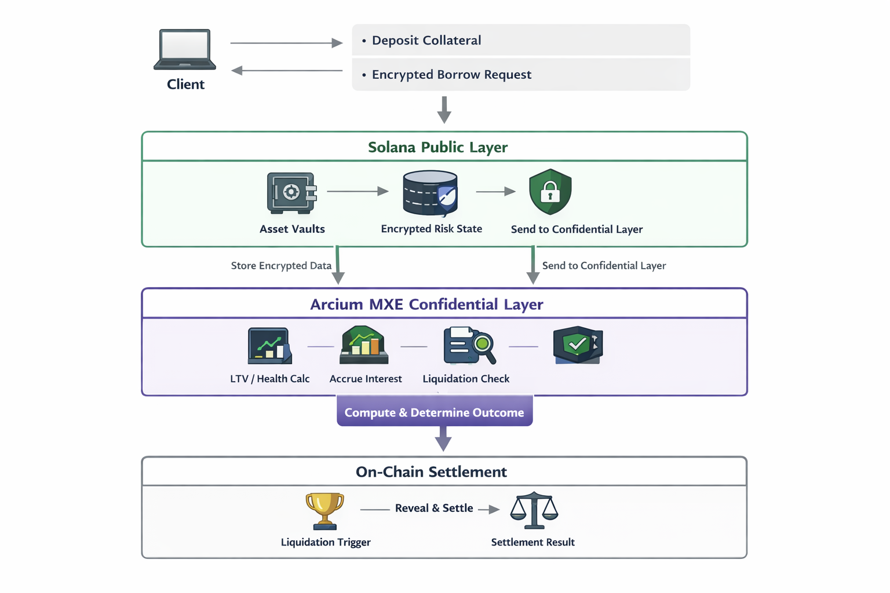

# ShieldLend (Solana + Arcium)

ShieldLend is a minimal confidential lending prototype built on Solana, integrating Arcium’s encrypted execution layer (MXE).

Traditional on-chain lending exposes collateral, borrows, LTV, health factors, and liquidation thresholds.  
This transparency can invite targeted liquidations and adversarial strategies.

ShieldLend explores a different model.

Collateral evaluation, LTV computation, interest accrual, and liquidation checks run inside Arcium’s encrypted state.  
Only final liquidation outcomes and settlement deltas are revealed on-chain.

---

## 🧠 The Problem

Most DeFi lending protocols expose risk metrics publicly:

- Collateral balances
- Borrowed amounts
- Loan-to-value (LTV)
- Health factor
- Liquidation thresholds

This enables:

- Liquidation sniping
- Predatory targeting of weak positions
- Bot-driven adversarial behavior
- Reduced borrower privacy

---

## 🔐 The Idea

Instead of exposing risk metrics publicly:

- Borrower inputs are encrypted client-side
- Encrypted state is stored on-chain as opaque blobs
- Arcium MXE computes:
  - collateral valuation (encrypted)
  - LTV / health factor (encrypted)
  - interest updates (encrypted)
  - liquidation checks (encrypted)
- Only minimal results are revealed:
  - liquidation outcome
  - settlement delta

---

## 🏗 Architecture Overview

Public Layer (Solana):
- Asset custody and deposits
- Encrypted state storage
- Settlement recording

Confidential Layer (Arcium MXE):
- LTV computation
- Interest accrual
- Health factor monitoring
- Liquidation condition checks

Arcium acts as the confidential execution environment.

---

## 🔄 Execution Flow

1. User deposits collateral.
2. User requests a borrow (encrypted).
3. Encrypted risk state is stored on-chain.
4. Arcium MXE computes LTV/interest/health factor privately.
5. Arcium MXE checks liquidation conditions privately.
6. Only final outcome is revealed and settled on Solana.

---

## 🔍 Privacy Model

Encrypted:
- Borrow size
- Collateral ratio (LTV)
- Health factor
- Liquidation threshold

Revealed:
- Liquidation outcome
- Settlement delta

The goal is not to hide defaults,
but to reduce predatory targeting before liquidation occurs.

---

## ⚠ Disclaimer

This is a minimal structural prototype for exploration within the Arcium ecosystem.

Not audited. Not production-ready.

---

Built for Arcium RTG.
